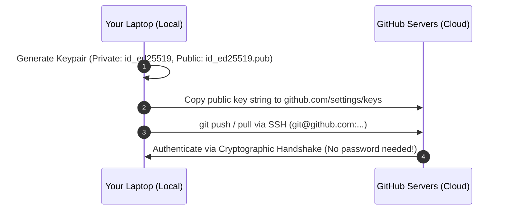
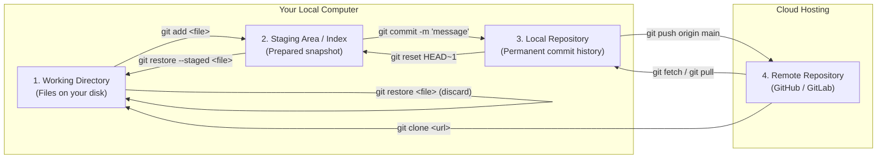
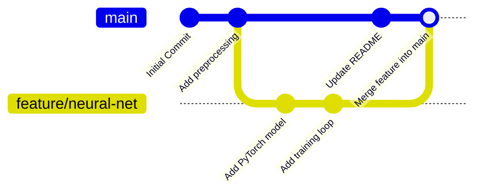
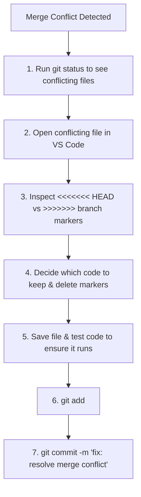
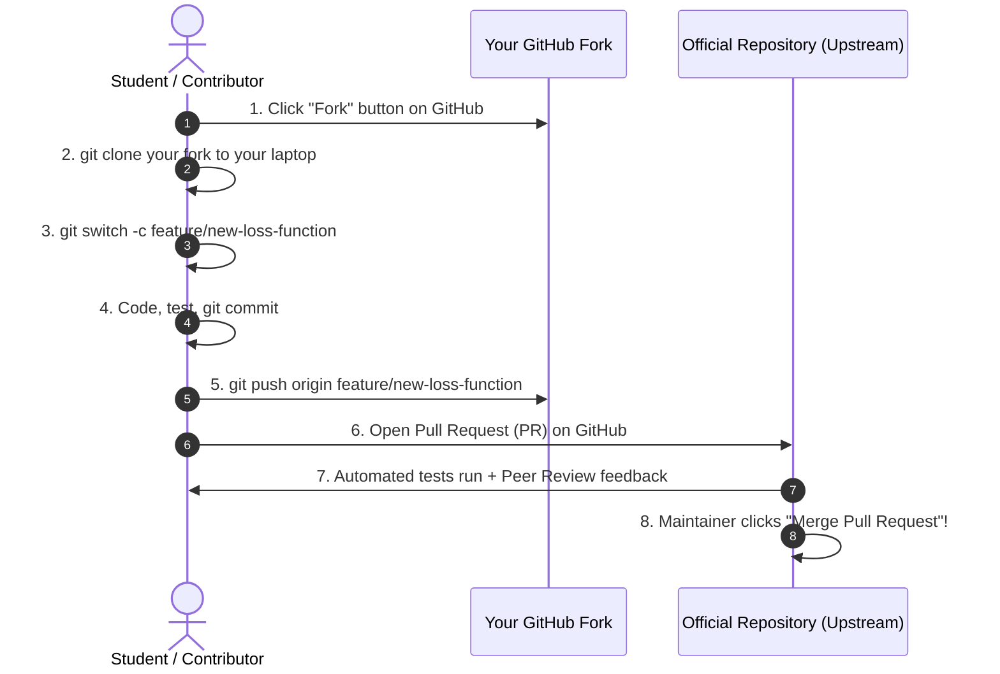

# 🚀 Master Git & GitHub: The Complete Guide for CSE & AIML Students

I am Upali.

> *From your very first commit to open-source contributions, team hackathons, and production-ready    machine learning workflows.*

[](https://git-scm.com/)
[](https://github.com/)
[](#-automated-setup--os-detection)
[](#-foundational-mental-models)

---

## 📑 Table of Contents

- [1. 🧭 Foundational Mental Models](#1--foundational-mental-models)
  - [The Horror Story: Why Do We Need Git?](#the-horror-story-why-do-we-need-git)
  - [What is Version Control?](#what-is-version-control)
  - [Git vs. GitHub: Demystifying the Difference](#git-vs-github-demystifying-the-difference)
  - [Centralized vs. Distributed Version Control](#centralized-vs-distributed-version-control)
- [2. ⚡ Automated Setup & OS Detection](#2--automated-setup--os-detection)
  - [Running the 1-Click Installer](#running-the-1-click-installer)
  - [Understanding Git Bash (Windows vs. macOS/Linux)](#understanding-git-bash-windows-vs-macoslinux)
  - [Verifying Your Installation](#verifying-your-installation)
  - [Essential Global Configurations](#essential-global-configurations)
  - [GitHub Authentication: SSH Keys vs. GitHub CLI](#github-authentication-ssh-keys-vs-github-cli)
- [3. 🏛️ Architecture & The 4 Stages of Git](#3-️-architecture--the-4-stages-of-git)
  - [The 4 Stages Explained](#the-4-stages-explained)
  - [The Git Lifecycle Diagram](#the-git-lifecycle-diagram)
  - [How Git Stores Data Under the Hood](#how-git-stores-data-under-the-hood)
- [4. 🛠️ Essential Git Commands (Daily Drivers)](#4-️-essential-git-commands-daily-drivers)
  - [Creating & Cloning Repositories](#creating--cloning-repositories)
  - [Inspecting & Staging Changes](#inspecting--staging-changes)
  - [Crafting Professional Commits](#crafting-professional-commits)
  - [Inspecting Differences & History](#inspecting-differences--history)
- [5. 🌿 Branching, Merging & Conflict Resolution](#5--branching-merging--conflict-resolution)
  - [What is a Branch?](#what-is-a-branch)
  - [Branch Management Commands](#branch-management-commands)
  - [Merging Strategies: Fast-Forward vs. 3-Way](#merging-strategies-fast-forward-vs-3-way)
  - [The Ultimate Merge Conflict Survival Guide](#the-ultimate-merge-conflict-survival-guide)
- [6. ⏪ Time Travel & Undoing Mistakes Safely](#6--time-travel--undoing-mistakes-safely)
  - [The "How to Undo Anything" Decision Matrix](#the-how-to-undo-anything-decision-matrix)
  - [Discarding Local Edits: `git restore`](#discarding-local-edits-git-restore)
  - [Commit Rollbacks: `git reset` (Soft, Mixed, Hard)](#commit-rollbacks-git-reset-soft-mixed-hard)
  - [Safe Public Undos: `git revert`](#safe-public-undos-git-revert)
  - [Stashing Work-In-Progress: `git stash`](#stashing-work-in-progress-git-stash)
  - [The Emergency Flight Recorder: `git reflog`](#the-emergency-flight-recorder-git-reflog)
- [7. 🌐 GitHub Collaboration: Team & Open-Source Workflows](#7--github-collaboration-team--open-source-workflows)
  - [Remotes: `fetch`, `pull`, and `push`](#remotes-fetch-pull-and-push)
  - [The Industry Standard: Fork & Pull Request (PR) Workflow](#the-industry-standard-fork--pull-request-pr-workflow)
  - [Issues, Milestones, and Automated Closing](#issues-milestones-and-automated-closing)
  - [Deploying Free Student Portfolios with GitHub Pages](#deploying-free-student-portfolios-with-github-pages)
  - [Introduction to GitHub Actions (CI/CD)](#introduction-to-github-actions-cicd)
- [8. 🤖 Git & GitHub for CSE & AIML Workflows](#8--git--github-for-cse--aiml-workflows)
  - [The 100MB File Limit & Large Datasets Dilemma](#the-100mb-file-limit--large-datasets-dilemma)
  - [The 3-Tier Storage Rule for AI Projects](#the-3-tier-storage-rule-for-ai-projects)
  - [Never Commit Secrets: API Keys & `.env`](#never-commit-secrets-api-keys--env)
  - [Managing Jupyter Notebooks (`.ipynb`) in Git](#managing-jupyter-notebooks-ipynb-in-git)
  - [Ideal CSE / AIML Project Structure](#ideal-cse--aiml-project-structure)
- [9. 🧪 Interactive Hands-on Labs & Challenges](#9--interactive-hands-on-labs--challenges)
  - [Lab 1: Your First Local Repository & Snapshot](#lab-1-your-first-local-repository--snapshot)
  - [Lab 2: Connecting to GitHub & Pushing to the Cloud](#lab-2-connecting-to-github--pushing-to-the-cloud)
  - [Lab 3: Simulated Team Merge Conflict Drill](#lab-3-simulated-team-merge-conflict-drill)
  - [Lab 4: Building a Machine Learning Experiment Repo](#lab-4-building-a-machine-learning-experiment-repo)
  - [🏆 Interactive Problem Challenge Suite (5 Sandboxed Dilemmas)](#-interactive-problem-challenge-suite)
- [10. 🚨 Emergency Troubleshooting, FAQs & Cheatsheet](#10--emergency-troubleshooting-faqs--cheatsheet)
  - [Escape the Dreaded Vim Editor](#escape-the-dreaded-vim-editor)
  - [Fixing "Detached HEAD State"](#fixing-detached-head-state)
  - [I Pushed an API Key / Secret by Accident!](#i-pushed-an-api-key--secret-by-accident)
  - [Comprehensive Command Cheatsheet](#comprehensive-command-cheatsheet)

---

## 1. 🧭 Foundational Mental Models

### The Horror Story: Why Do We Need Git?
Every college student before learning Git has experienced this directory:

```
📁 My_Machine_Learning_Project/
   ├── model.py
   ├── model_v1.py
   ├── model_v2_final.py
   ├── model_v2_final_FINAL.py
   ├── model_v2_final_really_final_works_now.py
   └── model_presentation_tonight_DO_NOT_TOUCH.py
```

- Which file contains the highest accuracy weights?
- What changes did your lab partner Alex make at 2:00 AM?
- If a new bug breaks training, how do you rewind to yesterday's working version?

**Git permanently solves this chaos.**

---

### What is Version Control?
A **Version Control System (VCS)** is like an automated time machine and a save-point system for your code (just like checkpoints in video games). 

Instead of duplicating entire folders, Git tracks **snapshots** of your project over time. You can:
- Rewind your code to any point in the past.
- Compare differences between any two dates or versions.
- Work on experimental features in parallel without breaking existing code.
- Merge contributions from teammates across the globe seamlessly.

---

### Git vs. GitHub: Demystifying the Difference

> [!IMPORTANT]
> **Git is NOT GitHub.** Confusing these two is the #1 mistake new engineering students make.

| Feature | Git | GitHub |
| :--- | :--- | :--- |
| **What is it?** | A local command-line software tool. | A cloud-based web hosting service. |
| **Where does it live?** | Installed directly on your personal computer. | Hosted on Microsoft's cloud servers. |
| **Does it need Internet?** | **No!** 95% of Git operations run 100% offline. | **Yes**, requires internet access. |
| **Primary Purpose** | Tracks history, records changes, manages branches. | Collaboration, code reviews, issues, portfolio showcase. |
| **Analogous to:** | The camera that takes the photo. | Instagram where you publish and share the album. |

---

### Centralized vs. Distributed Version Control
Older systems like SVN or CVS were **Centralized**: if the central server went down or you lost WiFi, you couldn't commit or inspect history.

**Git is Distributed**: Every single developer who clones a repository gets a **complete, independent clone of the entire project history** on their hard drive. You can commit, branch, inspect diffs, and revert changes on a flight with zero internet connection!

---

## 2. ⚡ Automated Setup & OS Detection

This repository includes automated setup scripts that detect your operating system, verify or install Git, configure Git Bash, and register the commands in your system `PATH`.

### Running the 1-Click Installer

#### 🪟 Windows Users:
1. Open this repository folder in File Explorer.
2. **Double-click `setup.bat`** (or right-click `setup.bat` -> **Run as Administrator** if your college PC has strict permissions).
3. The script will:
   - Detect 64-bit Windows.
   - Check if Git is already installed.
   - If missing, automatically install Git for Windows via `winget` or direct silent download.
   - Configure PATH so `git` is recognized globally in PowerShell, CMD, and VS Code.
   - Set up **Git Bash** and register the right-click explorer menu.
   - Prompt you to configure your student name and email.

#### 🍎 macOS Users:
1. Open your native **Terminal** app (`Command + Space`, type `Terminal`, press Enter).
2. Navigate to this directory and run:
   ```bash
   chmod +x setup.sh
   ./setup.sh
   ```
3. The script will check for Homebrew or trigger the Apple Command Line Tools installation.

#### 🐧 Linux Users (Ubuntu, Debian, Fedora, Arch, openSUSE):
1. Open your terminal in this directory and execute:
   ```bash
   chmod +x setup.sh
   ./setup.sh
   ```
2. The script identifies your Linux distribution (`apt`, `dnf`, `pacman`, or `zypper`), installs Git, configures PATH, and sets recommended defaults.

---

### Understanding Git Bash (Windows vs. macOS/Linux)

> [!NOTE]
> **Why do Windows students need "Git Bash", while Mac and Linux students do not?**
> - **Linux & macOS** are built on Unix foundations. Their native terminal (Terminal / iTerm2) already runs **Bash** or **Zsh**, with standard Unix commands (`ls`, `grep`, `cd`, `rm`, `ssh`).
> - **Windows** natively uses Command Prompt (CMD) and PowerShell, which historically had different syntax and tools.
> - **Git Bash** is a lightweight MinGW64 package bundled with Git for Windows. It provides Windows users with a complete Unix-style shell and utilities, giving all students the exact same developer experience regardless of OS.

---

### Verifying Your Installation

Open your terminal (**Git Bash** on Windows, **Terminal** on macOS/Linux) and run:

```bash
git --version
```

If configured properly, you should see output similar to:
```text
git version 2.48.1.windows.1   # (Windows)
# or
git version 2.45.2             # (macOS / Linux)
```

---

### Essential Global Configurations

Before you write your first line of code, tell Git who you are. Every commit you make is stamped with your name and email.

```bash
# 1. Set your full name (will be visible on GitHub commits)
git config --global user.name "Alex Johnson"

# 2. Set your email (USE THE SAME EMAIL registered with your GitHub account!)
git config --global user.email "alex.johnson@college.edu"

# 3. Standardize default branch name across industry standard
git config --global init.defaultBranch main

# 4. Configure line ending normalization:
# For Windows:
git config --global core.autocrlf true
# For macOS / Linux:
git config --global core.autocrlf input

# 5. Set default text editor (Recommended: VS Code)
git config --global core.editor "code --wait"
```

Verify your configuration at any time:
```bash
git config --list --global
```

---

### GitHub Authentication: SSH Keys vs. GitHub CLI

In 2021, GitHub deprecated using your regular account password over command line HTTPS. You must use either **SSH Keys** (recommended) or the **GitHub CLI**.

#### Option A: Setting Up an SSH Key (Recommended & One-Time Setup)



1. **Generate an Ed25519 SSH Keypair**:
   ```bash
   ssh-keygen -t ed25519 -C "your_github_email@example.com"
   ```
   *Press `Enter` 3 times to accept the default file path and skip passphrase for convenience.*

2. **Copy your Public Key**:
   - **On Windows (Git Bash)**:
     ```bash
     clip < ~/.ssh/id_ed25519.pub
     ```
   - **On macOS**:
     ```bash
     pbcopy < ~/.ssh/id_ed25519.pub
     ```
   - **On Linux**:
     ```bash
     cat ~/.ssh/id_ed25519.pub
     ```
     *(Select the printed string starting with `ssh-ed25519` and copy it).*

3. **Add Key to GitHub**:
   - Go to [GitHub Settings -> SSH and GPG keys](https://github.com/settings/keys).
   - Click **New SSH key**.
   - Title: `My College Laptop`.
   - Key type: `Authentication Key`.
   - Paste into the **Key** field and click **Add SSH key**.

4. **Test the Connection**:
   ```bash
   ssh -T git@github.com
   ```
   *Type `yes` if prompted about host authenticity.*  
   You will see:  
   `Hi <YourUsername>! You've successfully authenticated, but GitHub does not provide shell access.`

---

## 3. 🏛️ Architecture & The 4 Stages of Git

To understand Git intuitively, you must grasp **The 4 Stages**. Files move between these stages via specific Git commands:



### The 4 Stages Explained

1. **Working Directory (Untracked / Modified)**:
   - The actual physical files on your hard drive that you open, edit, and run in your IDE (VS Code, PyCharm).
   - Changes here are **uncommitted and vulnerable**; if your laptop crashes or files are deleted, Git cannot recover them.

2. **Staging Area / Index**:
   - The staging area is a buffer zone or drafting table.
   - You choose *specifically* which changes you want to include in the next snapshot using `git add`.
   - *Analogy*: Posing the group of actors before clicking the shutter of a camera.

3. **Local Repository (`.git/` folder)**:
   - When you execute `git commit`, Git takes a permanent cryptographic snapshot of everything currently in the staging area and records it into your local repository.
   - Even if you delete your working directory files, your commits are safely preserved in `.git`.

4. **Remote Repository (GitHub)**:
   - The cloud copy hosted on GitHub.
   - Used to share code with teammates, backup your work against hardware failure, and publish your open-source projects.

---

### How Git Stores Data Under the Hood
Git does not store diffs (line-by-line delta changes) like legacy VCS tools. **Git stores snapshots.**

- Every file is compressed and hashed into a 40-character hexadecimal string called a **SHA-1 hash** (e.g., `4a7b21e...`). Git calls this a **Blob**.
- Folders are represented as **Trees** pointing to blobs and subtrees.
- A **Commit** is simply a small text object containing:
  1. A pointer to the root tree snapshot.
  2. A pointer to the parent commit(s).
  3. Author name, email, timestamp.
  4. The commit message.
- **HEAD**: A simple pointer indicating your currently checked-out commit or branch.

---

## 4. 🛠️ Essential Git Commands (Daily Drivers)

### Creating & Cloning Repositories

```bash
# Initialize a brand-new Git repository in the current folder
git init

# Clone an existing remote repository onto your machine
git clone git@github.com:torvalds/linux.git
```

---

### Inspecting & Staging Changes

```bash
# Check repository status: which files are modified, untracked, or staged
git status

# Short, concise status format
git status -s

# Stage a specific file
git add main.py

# Stage all modified and new files in the entire project
git add .

# Interactive staging: review and stage specific chunks (hunks) of a file
git add -p
```

---

### Crafting Professional Commits

```bash
# Commit staged changes with an inline commit message
git commit -m "feat: implement linear regression gradient descent"

# Amend / update the most recent commit (fix a typo or add a forgotten file)
git add forgotten_file.py
git commit --amend --no-edit
```

#### 💡 The Anatomy of an Industry-Standard Commit Message
In tech companies and open-source projects, engineers adhere to the **Conventional Commits** specification:

```text
<type>(optional scope): <concise summary in imperative mood>

[optional detailed body explaining WHY, not WHAT]

[optional footer: Fixes #123]
```

**Common Commit Types:**
- `feat:` A new feature or algorithm (e.g., `feat: add YOLOv8 real-time object detection`).
- `fix:` A bug fix (e.g., `fix: resolve division by zero in loss computation`).
- `docs:` Documentation only changes (e.g., `docs: update installation instructions in README`).
- `refactor:` Code restructuring without changing behavior (e.g., `refactor: extract data preprocessor module`).
- `test:` Adding or updating unit tests (e.g., `test: add edge-case tests for tokenization`).
- `chore:` Maintenance tasks, dependency bumps (e.g., `chore: update requirements.txt`).

---

### Inspecting Differences & History

```bash
# Show unstaged modifications (Working Directory vs. Staging Area)
git diff

# Show staged modifications (Staging Area vs. Last Commit)
git diff --staged

# View commit history
git log

# Beautiful one-line tree view showing all branches and merges (STUDENT FAVORITE!)
git log --oneline --graph --decorate --all

# View stats of changed files per commit
git log --stat

# Inspect a specific commit's changes
git show <commit_hash>

# Find out who wrote each line in a file and in which commit
git blame data_loader.py
```

---

## 5. 🌿 Branching, Merging & Conflict Resolution

### What is a Branch?
In Git, a branch is not an expensive copy of your code. **A branch is simply an ultra-lightweight, 41-byte pointer to a commit hash.**

Creating 100 branches in Git takes less than 1 millisecond and negligible disk space!



---

### Branch Management Commands

> [!TIP]
> Modern Git introduced `git switch` and `git restore` to replace the overloaded legacy `git checkout` command. Always prefer `git switch` for branch navigation!

```bash
# List all local branches (* indicates currently active branch)
git branch

# List both local and remote tracking branches
git branch -a

# Create a new branch without switching to it
git branch feature/svm-classifier

# Create AND immediately switch to a new branch
git switch -c feature/svm-classifier

# Switch to an existing branch
git switch main

# Safely delete a branch that has already been merged
git branch -d feature/svm-classifier

# Force delete an unmerged experimental branch
git branch -D experiment/bad-idea
```

---

### Merging Strategies: Fast-Forward vs. 3-Way

1. **Fast-Forward Merge**:
   If the target branch (`main`) has had no new commits since you branched off, Git simply slides the `main` pointer forward to your feature branch's latest commit. No merge commit is generated.
   
2. **3-Way (Recursive/Ort) Merge**:
   If both `main` and your feature branch have moved forward independently, Git combines the two branches using their common ancestor and creates a new **Merge Commit** with two parents.

```bash
# 1. Switch to the branch you want to merge INTO
git switch main

# 2. Merge the feature branch into main
git merge feature/svm-classifier
```

---

### The Ultimate Merge Conflict Survival Guide

A merge conflict happens when Git cannot automatically decide how to combine changes—specifically, when **two developers edit the exact same lines of the same file on different branches**.



#### Anatomy of Conflict Markers:
When a conflict occurs, Git marks the affected section inside your file:

```python
<<<<<<< HEAD (Current Change: your code on the branch you are on, e.g. main)
def compute_loss(y_true, y_pred):
    return torch.nn.functional.mse_loss(y_true, y_pred)
=======
def compute_loss(y_true, y_pred):
    # Team member's change: using cross entropy loss
    return torch.nn.functional.cross_entropy(y_true, y_pred)
>>>>>>> feature/loss-upgrade (Incoming Change: branch you are merging in)
```

#### How to Resolve:
1. Delete the `<<<<<<<`, `=======`, and `>>>>>>>` divider lines.
2. Edit the code to combine or select the correct logic (e.g., support both losses via a parameter).
3. Save the file.
4. Run:
   ```bash
   git add <file>
   git commit -m "fix: resolve merge conflict in compute_loss"
   ```

*(In VS Code, helpful buttons will appear above the conflict: **Accept Current Change**, **Accept Incoming Change**, **Accept Both Changes**, or **Compare Changes**).*

---

## 6. ⏪ Time Travel & Undoing Mistakes Safely

### The "How to Undo Anything" Decision Matrix

| Situation | Command | What happens? | Safety Level |
| :--- | :--- | :--- | :--- |
| Made a typo in `model.py`, want to revert to last saved state | `git restore model.py` | Discards unstaged edits on that file. | ⚠️ Permanent loss of unstaged edits |
| Accidentally ran `git add .`, want to unstage a file | `git restore --staged model.py` | Removes file from staging area, edits stay on disk. | ✅ 100% Safe |
| Committed locally, want to undo the commit but keep code in staging | `git reset --soft HEAD~1` | Undoes commit, preserves changes staged. | ✅ 100% Safe |
| Committed locally, want to undo commit and unstage code | `git reset --mixed HEAD~1` | Undoes commit, keeps edits in working directory. | ✅ 100% Safe |
| Catastrophic disaster, discard commit and all code completely | `git reset --hard HEAD~1` | Destroys commit AND working directory edits. | 🚨 High Danger |
| Revert a commit that has ALREADY been pushed to GitHub | `git revert <commit_hash>` | Creates a brand-new commit that inverses the changes. | ✅ Best Practice for Shared Repos |

---

### Discarding Local Edits: `git restore`
```bash
# Discard modifications in a specific file
git restore train.py

# Discard all modifications in current directory
git restore .

# Unstage a file without losing its edits
git restore --staged data_loader.py
```

---

### Commit Rollbacks: `git reset` (Soft, Mixed, Hard)

```bash
# HEAD~1 means "1 commit before the current one"

# Soft reset: undo commit, leave files in staging area ready to re-commit
git reset --soft HEAD~1

# Mixed reset (default): undo commit, leave files in working directory
git reset --mixed HEAD~1

# Hard reset: wipe out the commit and all code associated with it
git reset --hard HEAD~1
```

> [!CAUTION]
> **Never use `git reset --hard` on commits that have already been pushed to a shared team repository on GitHub!** It rewrites history and breaks your teammates' branches. Use `git revert` instead.

---

### Safe Public Undos: `git revert`
When collaborating on GitHub, never erase history. Instead, record an **inversion commit**:

```bash
# Creates a new commit that reverses commit 4b2a8f9
git revert 4b2a8f9
```

---

### Stashing Work-In-Progress: `git stash`
Imagine you are halfway through training a neural network experiment, and your professor asks you to immediately fix a typo on the `main` branch. You can't commit incomplete code, but you can't switch branches with uncommitted conflicts.

**Enter `git stash`**: It acts like a temporary clipboard for dirty working directory state.

```bash
# Save dirty changes onto the stash clipboard
git stash push -m "wip: hyperparameter tuning experiment"

# Check your saved stashes
git stash list

# Switch to main, fix the bug, commit, and push
git switch main
# ... fix bug, commit ...

# Return to your feature branch and retrieve your stashed work
git switch feature/tuning
git stash pop
```

---

### The Emergency Flight Recorder: `git reflog`
Did you accidentally delete a branch? Did you run `git reset --hard` and lose a commit you worked on all night?

**Don't panic.** Git almost never deletes data immediately. `git reflog` records every single movement of the `HEAD` pointer on your machine:

```bash
git reflog
```
Output:
```text
3e9b112 HEAD@{0}: reset: moving to HEAD~1
7a82c40 HEAD@{1}: commit: add complete transformer architecture
...
```

You can restore your lost commit instantly:
```bash
git reset --hard 7a82c40
```

---

## 7. 🌐 GitHub Collaboration: Team & Open-Source Workflows

### Remotes: `fetch`, `pull`, and `push`

```bash
# View configured remote repositories
git remote -v

# Link your local repo to a GitHub repository
git remote add origin git@github.com:your-username/my-project.git

# Push your branch and configure upstream tracking (-u)
git push -u origin main

# Download remote changes WITHOUT merging them into your working files
git fetch origin

# Download and immediately merge remote changes into current branch
# (git pull = git fetch + git merge)
git pull origin main
```

---

### The Industry Standard: Fork & Pull Request (PR) Workflow

When contributing to open-source or working in professional software engineering teams, nobody commits directly to `main`. Everyone uses the **Feature Branch + Pull Request** model.



#### Detailed Steps:
1. **Fork**: Click the **Fork** button on the top-right of any GitHub repository to create a copy under your account.
2. **Clone**: Clone your fork locally:
   ```bash
   git clone git@github.com:your-username/repo-name.git
   cd repo-name
   ```
3. **Configure Upstream Remote**:
   ```bash
   git remote add upstream git@github.com:original-organization/repo-name.git
   ```
4. **Create a Feature Branch**:
   ```bash
   git switch -c feature/improved-tokenization
   ```
5. **Commit & Push**:
   ```bash
   git add .
   git commit -m "feat: optimize tokenization with multiprocessing"
   git push -u origin feature/improved-tokenization
   ```
6. **Open PR**: Visit the original repository on GitHub. Click **Compare & pull request**, write a description of your changes, and submit!

---

### Issues, Milestones, and Automated Closing
- **GitHub Issues**: Used to report bugs, request features, or track project tasks.
- **Automated Closing**: If you write special keywords in your commit message or PR description:
  ```bash
  git commit -m "fix: resolve out-of-memory error in dataloader (Closes #42)"
  ```
  When this commit is merged into `main`, GitHub automatically closes Issue #42!
  *Keywords: `Fixes #num`, `Closes #num`, `Resolves #num`*.

---

### Deploying Free Student Portfolios with GitHub Pages
GitHub provides free hosting for static HTML/CSS/JavaScript websites:
1. Create a repository named `<your-username>.github.io`.
2. Push your portfolio code with an `index.html`.
3. Go to **Settings -> Pages** -> Source: `Deploy from a branch` -> Select `main` -> Click **Save**.
4. Your personal developer portfolio is live at `https://<your-username>.github.io` within 60 seconds!

---

### Introduction to GitHub Actions (CI/CD)
GitHub Actions allows you to run automated scripts whenever someone pushes code or opens a PR. 

Example: Automatically run your pytest unit tests on every commit:
Create `.github/workflows/tests.yml`:

```yaml
name: Python Unit Tests
on: [push, pull_request]

jobs:
  test:
    runs-on: ubuntu-latest
    steps:
      - uses: actions/checkout@v4
      - name: Set up Python
        uses: actions/setup-python@v5
        with:
          python-version: '3.11'
      - name: Install dependencies
        run: |
          python -m pip install --upgrade pip
          pip install -r requirements.txt
          pip install pytest
      - name: Run Pytest
        run: pytest
```

---

## 8. 🤖 Git & GitHub for CSE & AIML Workflows

As an Artificial Intelligence & Machine Learning student, your workflow differs significantly from standard web development. Understanding how Git interacts with data and neural network weights is vital.

### The 100MB File Limit & Large Datasets Dilemma

> [!WARNING]
> GitHub rejects any individual file larger than **100 MB**, and warns you above **50 MB**. Repositories larger than **1-2 GB** face severe bandwidth throttling.

If you attempt to push a 2GB raw dataset or a 500MB PyTorch `.pth` checkpoint, your push will fail with:
`remote: error: File big_dataset.csv is 105.20 MB; this exceeds GitHub's file size limit of 100.00 MB`

Even worse: because Git tracks entire history, even if you delete the file in your next commit, the file remains baked into your `.git` history!

---

### The 3-Tier Storage Rule for AI Projects

| Storage Layer | What Goes Here? | Tool / Service |
| :--- | :--- | :--- |
| **Tier 1: Code & Architecture** | Python scripts, config YAMLs, documentation, tests | **Git & GitHub** |
| **Tier 2: Data & Large Weights** | Raw/Processed datasets, checkpoints (`.pt`, `.safetensors`, `.onnx`) | **Cloud Storage (S3 / GDrive / HuggingFace Hub / DVC / Git LFS)** |
| **Tier 3: Experiments & Metrics** | Loss curves, hyperparameter tuning logs, validation confusion matrices | **Weights & Biases (WandB) / MLflow / TensorBoard** |

---

### Never Commit Secrets: API Keys & `.env`

Never, under any circumstances, hardcode or commit API keys:
- ❌ `OPENAI_API_KEY = "sk-proj-12345..."`
- ❌ `HUGGINGFACE_TOKEN = "hf_abc123..."`
- ❌ `KAGGLE_KEY = "..."`

Bots scrape public GitHub commits in real-time. Within **3 seconds** of pushing an unmasked OpenAI key or AWS credential, bots will drain your wallet or hijack your cloud quota.

#### The Safe Pattern:
1. Store keys in a local `.env` file:
   ```env
   OPENAI_API_KEY=sk-proj-your-secret-key-here
   HUGGINGFACE_TOKEN=hf_your-token-here
   ```
2. Verify `.env` is listed in your `.gitignore` (our provided `.gitignore` already does this!).
3. Provide a safe `.env.example` template for teammates:
   ```env
   OPENAI_API_KEY=your_key_here
   HUGGINGFACE_TOKEN=your_token_here
   ```
4. Read variables securely in Python using `python-dotenv`:
   ```python
   import os
   from dotenv import load_dotenv

   load_dotenv()
   api_key = os.getenv("OPENAI_API_KEY")
   ```

---

### Managing Jupyter Notebooks (`.ipynb`) in Git

Jupyter Notebooks are secretly JSON files that record not just your code, but also:
- Execution count counters (`"execution_count": 42`).
- Giant embedded Base64 strings of plotted graphs.
- Temporary runtime metadata.

This makes diffing notebooks painful and causes nasty merge conflicts.

**Student Best Practices for Notebooks:**
1. **Clear all outputs** before committing (`Kernel -> Restart and Clear Output` in Jupyter/VS Code).
2. Install [`nbstripout`](https://github.com/kynan/nbstripout) to automatically strip notebook outputs before commit:
   ```bash
   pip install nbstripout
   nbstripout --install
   ```
3. Convert production ML training pipelines from notebooks to modular `.py` scripts (`train.py`, `evaluate.py`, `model.py`).

---

### Ideal CSE / AIML Project Structure

A professional repository layout for hackathons and academic resumes:

```
📁 sentiment-analysis-bert/
├── 📁 .github/
│   └── 📁 workflows/
│       └── tests.yml           # Automated CI testing
├── 📁 data/
│   ├── .gitkeep                # Keeps directory tracked without tracking large files
│   └── README.md               # Instructions on how to download raw dataset
├── 📁 src/
│   ├── __init__.py
│   ├── dataset.py              # PyTorch / TF data loaders
│   ├── model.py                # Neural network architecture
│   ├── train.py                # Training pipeline
│   └── utils.py                # Helper functions
├── 📁 tests/
│   └── test_model.py           # Unit tests
├── .env.example                # Safe environment variable template
├── .gitignore                  # Clean course-tailored ignore rules
├── requirements.txt            # Python dependencies (pip install -r requirements.txt)
├── LICENSE                     # Open source license (e.g. MIT, Apache 2.0)
└── README.md                   # Professional project presentation
```

---

## 9. 🧪 Interactive Hands-on Labs

### Lab 1: Your First Local Repository & Snapshot
**Objective**: Practice initializing, staging, committing, and inspecting a project 100% offline.

```bash
# 1. Create a new sandbox directory and enter it
mkdir git-lab-1 && cd git-lab-1

# 2. Initialize Git
git init

# 3. Create a simple Python script
echo "print('Welcome to 1st Year AIML!')" > app.py

# 4. Check status (app.py will show up as untracked in red)
git status

# 5. Stage the file (now ready in green)
git add app.py

# 6. Commit the file to permanent history
git commit -m "feat: initial commit with greeting script"

# 7. Modify the file
echo "print('Version 2: Machine Learning is fun.')" >> app.py

# 8. Check differences
git diff

# 9. Stage and commit the modification
git add app.py
git commit -m "feat: add second message to app"

# 10. Inspect your commit history log
git log --oneline --graph
```

---

### Lab 2: Connecting to GitHub & Pushing to the Cloud
**Objective**: Connect your local repo to GitHub using SSH/HTTPS.

1. Go to [github.com/new](https://github.com/new).
2. Set repository name: `aiml-lab-demo`.
3. Choose **Public**. **Do NOT** check "Add a README file" (we already created files locally).
4. Click **Create repository**.
5. In your terminal, run the commands displayed by GitHub:
   ```bash
   # Rename default branch to main (if not already)
   git branch -M main

   # Link your local repo to GitHub (replace with your repo URL)
   git remote add origin git@github.com:<your-username>/aiml-lab-demo.git

   # Push your code to GitHub
   git push -u origin main
   ```
6. Refresh your browser: your code is live on the internet!

---

### Lab 3: Simulated Team Merge Conflict Drill
**Objective**: Purposefully create and resolve a merge conflict on your own machine.

```bash
# 1. Create sandbox
mkdir conflict-lab && cd conflict-lab && git init

# 2. Create base script and commit
echo "learning_rate = 0.01" > config.py
git add config.py
git commit -m "chore: set base learning rate"

# 3. Create teammate branch A (Alice)
git switch -c alice-branch
echo "learning_rate = 0.05 # Alice optimized this" > config.py
git commit -am "fix: tune learning rate to 0.05"

# 4. Switch back to main and create teammate branch B (Bob)
git switch main
git switch -c bob-branch
echo "learning_rate = 0.001 # Bob lowered this for Adam optimizer" > config.py
git commit -am "fix: tune learning rate to 0.001"

# 5. Merge Alice into main (merges smoothly)
git switch main
git merge alice-branch

# 6. Now attempt to merge Bob into main -> CONFLICT TRIGGERED!
git merge bob-branch
```
*Notice Git reports:*  
`CONFLICT (content): Merge conflict in config.py. Automatic merge failed; fix conflicts and then commit the result.`

**Resolution:**
1. Open `config.py` in your text editor.
2. Observe the `<<<<<<< HEAD`, `=======`, and `>>>>>>> bob-branch` markers.
3. Edit `config.py` to reconcile the conflict:
   ```python
   # Combined resolution: allow setting via variable
   learning_rate = 0.005 # Team agreed compromise
   ```
4. Save the file and complete the merge:
   ```bash
   git add config.py
   git commit -m "fix: resolve merge conflict between Alice and Bob hyperparameter tuning"
   ```
5. View the resulting merged graph:
   ```bash
   git log --oneline --graph
   ```

---

### Lab 4: Building a Machine Learning Experiment Repo
**Objective**: Build a clean project utilizing `.gitignore` to prevent committing datasets or junk files.

1. Copy the provided `.gitignore` from this repository into your project root.
2. Create dummy dataset and weights:
   ```bash
   # Create dummy dataset and cache
   echo "sample,data,123" > massive_dataset.csv
   echo "weights_bytes" > model_checkpoint.pt
   mkdir -p __pycache__ && echo "cache" > __pycache__/module.pyc
   echo "import torch" > train.py
   ```
3. Run `git status`:
   - Notice that `massive_dataset.csv`, `model_checkpoint.pt`, and `__pycache__` **do not even appear**!
   - Only `train.py` and `.gitignore` are tracked.
4. Your repository remains lightweight, secure, and lightning fast.

---

### 🏆 Interactive Problem Challenge Suite

Put your knowledge to the test with real repository failure drills! Each challenge includes an automated scenario generator (`setup.bat` / `setup.sh`) creating an isolated broken workspace, along with an instant solution verification script (`verify.bat` / `verify.sh`):

1. [**Problem 01: The Detached Time Traveler**](./problems/01-detached-head) — Recover from an accidental detached time-travel state and restore all commit history.
2. [**Problem 02: Accidental Staging of Secrets & Bloat**](./problems/02-accidental-staging-secrets) — Unstage confidential API keys and datasets without deleting local files and configure permanent ignore protection.
3. [**Problem 03: The Interrupted Feature**](./problems/03-unfinished-work-stash) — Safely shelve uncommitted, broken code during an urgent branch switch and synchronize hotfixes cleanly.
4. [**Problem 04: The Merge Conflict Showdown**](./problems/04-merge-conflict-showdown) — Resolve conflicting lines between teammate branches, eliminate conflict markers, and finalize the merge commit.
5. [**Problem 05: Committed to the Wrong Branch**](./problems/05-committed-to-wrong-branch) — Relocate an experimental prototype commit from `main` onto `feature/biometric` and rewind `main` back to stable release.

👉 **[Start the Challenges in the Problems Directory](./problems)**

---

## 10. 🚨 Emergency Troubleshooting, FAQs & Cheatsheet

### Escape the Dreaded Vim Editor
If you run `git commit` without the `-m` flag, Git drops you into **Vim**, a terminal text editor with modal controls. Many beginners get stuck unable to type or exit.

```
How to Exit Vim:
1. Press the [ESC] key twice.
2. Type exactly:  :wq   (write and quit)
3. Press [ENTER].

If you messed up and just want to abort without saving:
1. Press [ESC] twice.
2. Type exactly:  :q!   (quit and discard changes)
3. Press [ENTER].
```

**Permanent Fix (Set VS Code as your default Git editor):**
```bash
git config --global core.editor "code --wait"
```

---

### Fixing "Detached HEAD State"
If `git status` says: `HEAD detached at a1b2c3d`:
- It means you checked out a specific commit hash rather than a branch name. You are in "read-only view mode".
- **To get back to safety**:
  ```bash
  git switch main
  ```
- **If you made commits in detached state that you want to keep**:
  ```bash
  git switch -c rescue-my-commits
  ```

---

### I Pushed an API Key / Secret by Accident!
1. **Immediately revoke / regenerate the key** in your OpenAI / AWS / HuggingFace dashboard. Assume the key has already been scraped.
2. Do not just delete the line and push again; the secret remains in your previous commit history.
3. Install and run [BFG Repo-Cleaner](https://rtyley.github.io/bfg-repo-cleaner/) or `git-filter-repo` to scrub the secret from all commits:
   ```bash
   git filter-repo --replace-text passwords.txt
   git push origin --force --all
   ```

---

### Comprehensive Command Cheatsheet

| Task | Command |
| :--- | :--- |
| **Setup & Identity** | `git config --global user.name "Your Name"`<br>`git config --global user.email "email@domain.com"` |
| **Initialize Repo** | `git init` |
| **Clone Remote** | `git clone <repo_url>` |
| **Check Status** | `git status` (or `git status -s` for concise view) |
| **Stage Changes** | `git add <file>` (or `git add .` for all) |
| **Commit Changes** | `git commit -m "feat: description"` |
| **Amend Last Commit** | `git commit --amend` |
| **View Differences** | `git diff` (unstaged) / `git diff --staged` (staged) |
| **View History Log** | `git log --oneline --graph --decorate --all` |
| **Create & Switch Branch** | `git switch -c <branch_name>` |
| **Switch Branch** | `git switch <branch_name>` |
| **Merge Branch** | `git merge <branch_name>` |
| **Unstage a File** | `git restore --staged <file>` |
| **Discard Local Edits** | `git restore <file>` |
| **Soft Reset (Keep staged)**| `git reset --soft HEAD~1` |
| **Mixed Reset (Keep files)**| `git reset --mixed HEAD~1` |
| **Invert Public Commit** | `git revert <commit_hash>` |
| **Stash Work** | `git stash` (retrieve with `git stash pop`) |
| **Rescue Lost Commits** | `git reflog` |
| **Add Remote** | `git remote add origin <url>` |
| **Push Upstream** | `git push -u origin <branch>` |
| **Pull Latest** | `git pull` |

---

## 🎓 Summary & Next Steps for Students

Congratulations! You now possess an in-depth understanding of:
- The distinction between Git and GitHub.
- How snapshots, trees, and commits function under the hood.
- Branching, merging, and resolving conflicts like a senior software engineer.
- Writing clean commits and collaborating via Open-Source Pull Requests.
- Preventing catastrophic leaks of datasets and API credentials in your AI/ML projects.

**Keep this repository bookmarked, complete the 4 hands-on labs, and happy hacking!**
