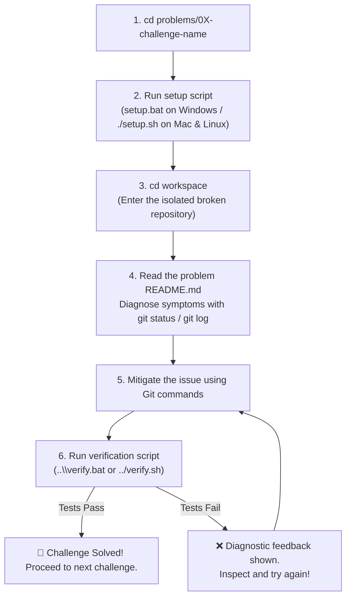

# 🎯 Git Practical Challenges: Real-World Repository Dilemmas

Welcome to the **Hands-On Git Challenge Suite** designed for First-Year CSE & AIML students!

In college group projects, hackathons, and engineering teams, things don't always go smoothly. You will encounter strange error messages, detached states, accidental secret commits, and merge collisions.

These interactive problems allow you to practice diagnosing and fixing real repository issues in a **safe, isolated sandbox** before facing them in graded projects or production code.

---

## 🏆 Challenge Index

| # | Challenge Name | Focus Area | Real-World Dilemma | Suryansh
| :-: | :--- | :--- | :--- |
| **01** | [**The Detached Time Traveler**](./01-detached-head) | History & Branches | You inspected past code and now Git warns you are in "Detached HEAD" state. |
| **02** | [**Accidental Staging of Secrets**](./02-accidental-staging-secrets) | Staging & Security | A teammate staged a sensitive API key and a 50MB dataset right before commit. |
| **03** | [**The Interrupted Feature**](./03-unfinished-work-stash) | Workflow & Stashing | Urgent bug on `main`, but your feature branch has broken uncommitted code. |
| **04** | [**Merge Conflict Showdown**](./04-merge-conflict-showdown) | Merging & Collaboration | Two teammates changed the exact same lines; Git halts with conflict markers. |
| **05** | [**Committed to the Wrong Branch**](./05-committed-to-wrong-branch) | Branch Management | An experimental commit was accidentally made directly onto stable `main`. |

---

## 🛠️ How to Attempt Any Challenge

Every challenge folder is self-contained and follows the exact same workflow:



### Step 1: Open Terminal & Navigate to Problem
```bash
cd problems/01-detached-head
```

### Step 2: Set Up the Broken Scenario
- **On Windows**: Double-click `setup.bat` or run:
  ```cmd
  setup.bat
  ```
- **On macOS / Linux**:
  ```bash
  chmod +x setup.sh verify.sh
  ./setup.sh
  ```
*(This automatically creates a sandboxed broken Git repository in `workspace/`).*

### Step 3: Enter the Sandbox & Read the Challenge
```bash
cd workspace
```
Open `../README.md` (or view it on GitHub) to understand the story, observed symptoms, and acceptance criteria.
**Note**: The README will explain the scenario, but will **NOT** reveal the commands or solution!

### Step 4: Fix the Issue Using Git Commands
Run your diagnostic commands (`git status`, `git log`, `git diff`, etc.) and use your Git knowledge to resolve the dilemma.

### Step 5: Verify Your Solution
You can verify your solution directly from inside `workspace`:
- **On Windows**:
  ```cmd
  ..\verify.bat
  ```
- **On macOS / Linux**:
  ```bash
  ../verify.sh
  ```

If you ever get hopelessly stuck or make an unrecoverable mistake, simply re-run the setup script (`setup.bat` or `./setup.sh`) to reset the workspace to its initial challenge state!

---

## 📜 Challenge Rules

1. **No Folder Deletion**: Do not fix a problem by deleting the `workspace` folder or copying files from elsewhere. Use pure Git commands.
2. **Preserve Code Integrity**: Unless instructed to edit code (such as resolving merge conflict markers), do not arbitrarily erase code files.
3. **Think Before You Reset**: When using history modification commands, always remember whether changes will be preserved or destroyed.
